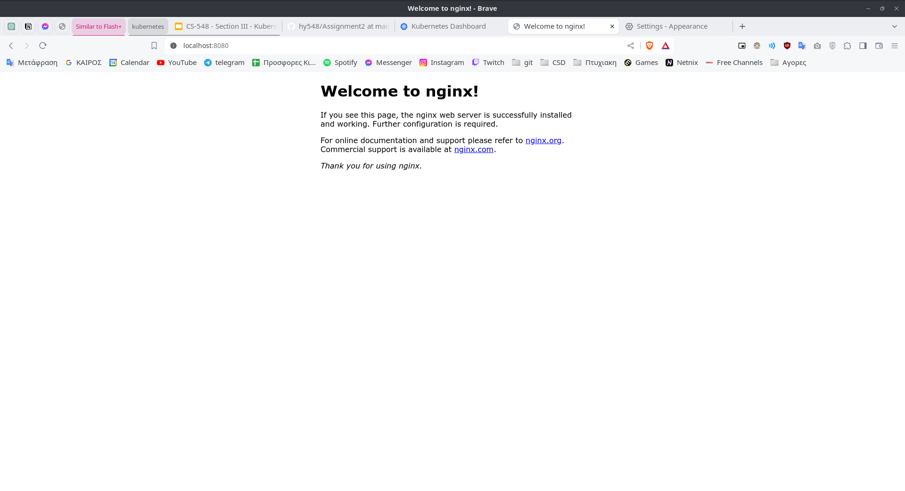
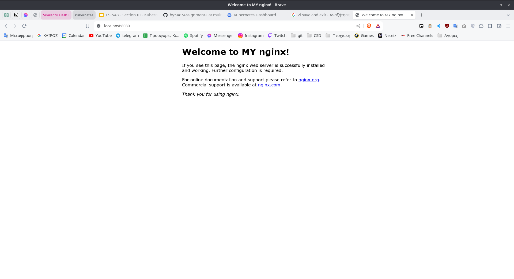
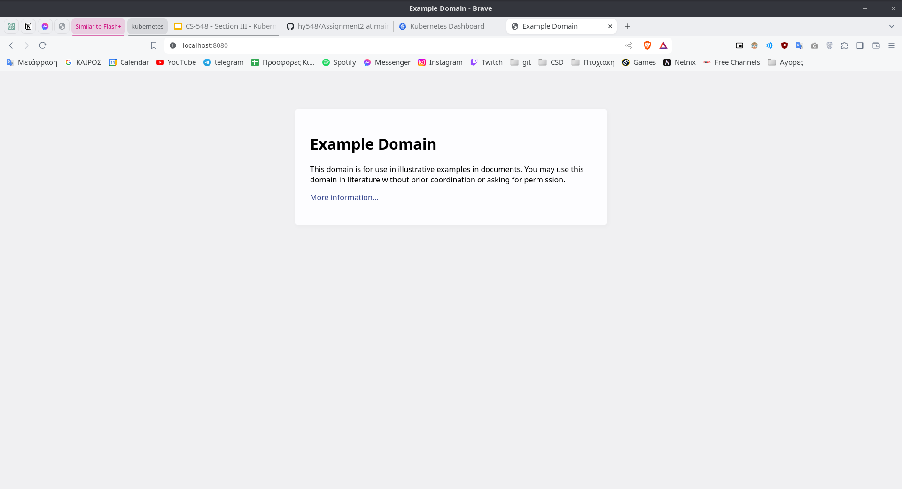

# Assignment 2
# Name: Konstantinos Loukas
# AM: csdp1375
<details>
<summary>Exercise 1</summary>


1. Install the manifest on Kubernetes and start the Pod.
    ```
    >kubectl apply -f Ex1.yaml
    pod/mypod created

    >kubectl get pods
    NAME    READY   STATUS    RESTARTS   AGE
    mypod   1/1     Running   0          17s
    ```
2. Forward port 80 locally, so that it answers calls through a browser (or curl or wget).

    ```
    >kubectl apply -f Ex1.yaml

    >kubectl port-forward pod/mypod 8080:80
    Forwarding from 127.0.0.1:8080 -> 80
    Forwarding from [::1]:8080 -> 80
    Handling connection for 8080

    ````


3. See the logs of the running container.
    ```
    >kubectl logs mypod
    /docker-entrypoint.sh: /docker-entrypoint.d/ is not empty, will attempt to perform configuration
    /docker-entrypoint.sh: Looking for shell scripts in /docker-entrypoint.d/
    /docker-entrypoint.sh: Launching /docker-entrypoint.d/10-listen-on-ipv6-by-default.sh
    10-listen-on-ipv6-by-default.sh: info: Getting the checksum of /etc/nginx/conf.d/default.conf
    10-listen-on-ipv6-by-default.sh: info: Enabled listen on IPv6 in /etc/nginx/conf.d/default.conf
    /docker-entrypoint.sh: Launching /docker-entrypoint.d/20-envsubst-on-templates.sh
    /docker-entrypoint.sh: Launching /docker-entrypoint.d/30-tune-worker-processes.sh
    /docker-entrypoint.sh: Configuration complete; ready for start up
    2024/03/16 07:08:43 [notice] 1#1: using the "epoll" event method
    2024/03/16 07:08:43 [notice] 1#1: nginx/1.23.3
    2024/03/16 07:08:43 [notice] 1#1: built by gcc 12.2.1 20220924 (Alpine 12.2.1_git20220924-r4) 
    2024/03/16 07:08:43 [notice] 1#1: OS: Linux 5.15.0-97-generic
    2024/03/16 07:08:43 [notice] 1#1: getrlimit(RLIMIT_NOFILE): 1048576:1048576
    2024/03/16 07:08:43 [notice] 1#1: start worker processes
    2024/03/16 07:08:43 [notice] 1#1: start worker process 30
    2024/03/16 07:08:43 [notice] 1#1: start worker process 31
    2024/03/16 07:08:43 [notice] 1#1: start worker process 32
    2024/03/16 07:08:43 [notice] 1#1: start worker process 33
    2024/03/16 07:08:43 [notice] 1#1: start worker process 34
    2024/03/16 07:08:43 [notice] 1#1: start worker process 35
    127.0.0.1 - - [16/Mar/2024:07:12:42 +0000] "GET / HTTP/1.1" 200 615 "-" "Mozilla/5.0 (X11; Linux x86_64) AppleWebKit/537.36 (KHTML, like Gecko) Chrome/122.0.0.0 Safari/537.36" "-"
    127.0.0.1 - - [16/Mar/2024:07:12:42 +0000] "GET /favicon.ico HTTP/1.1" 404 555 "http://localhost:8080/" "Mozilla/5.0 (X11; Linux x86_64) AppleWebKit/537.36 (KHTML, like Gecko) Chrome/122.0.0.0 Safari/537.36" "-"
    2024/03/16 07:12:42 [error] 32#32: *1 open() "/usr/share/nginx/html/favicon.ico" failed (2: No such file or directory), client: 127.0.0.1, server: localhost, request: "GET /favicon.ico HTTP/1.1", host: "localhost:8080", referrer: "http://localhost:8080/"
    ```

4. Open a shell session inside the running container and change the first sentence of the default page to "Welcome to MY nginx!". Close the session.
    
    ```
    >kubectl exec -it mypod -- /bin/sh
    >cd usr/share/nginx/html/
    >vi index.html
    ```



5. From your computer terminal (outside the container), download the default page locally and upload another one in its place.
    
    ```
    >kubectl cp default/mypod:/usr/shared/nginx/html/index.html .
    >kubectl cp ./new_index.html default/mypod:/usr/share/nginx/html/index.html

    ```



6. Stop the Pod and remove the manifest from Kubernetes.

    ```
    >kubectl delete pod mypod
    pod "mypod" deleted

    >kubectl delete -f Ex1.yaml
    pod "mypod" deleted
    ```

</details>

<details>
<summary>Exercise 2</summary>

1. The code that produces the course's website is available on GitHub (https://github.com/chazapis/hy548). Provide the YAML that creates a Job using Ubuntu 20.04, which when started will run a script (defined in a ConfigMap) that will download the repository (and submodules), hugo (the tool that builds the website), and build the website. 
    
    ```
    >kubectl apply -f Ex2.yaml
    ```

2. Which command can you use to confirm that the Job completed successfully?
    ```
    > kubectl get jobs
    NAME    COMPLETIONS   DURATION   AGE
    myjob   1/1           4s         27s
    ```

    Μπορουμε να δουμε στην στηλη COMPLETIONS οτι το job "myjob" εχει τελειωσει με επιτυχια.

</details>

<details>
<summary>Exercise 3</summary>

1. Following the previous two exercises, provide a single YAML that will run the Pod with Nginx, the above Job with the script, and a CronJob that will refresh the content every night at 2:15 (only if changes have been made to git). The Nginx Pod should serve the web pages produced by the Jobs instead of the default page. 

    ```
    >kubectl apply -f Ex3.yaml
    ```


2. Briefly describe how data is communicated between containers.

    Για να μπορέσουν τα διάφορα containers να επικοινωνήσουν μεταξύ τους έφτιαξα ένα Persistent Volume όπου γίνεται consume με την χρήση persistentVolumeClaim από τα διάφορα containers και κανουν mount το ίδιο volume αυτό. Έτσι μπορούν και μοιράζονται τα shared δεδομένα-αρχεία όπου βρίσκονται στο volume αυτό.

</details>

<details>
<summary>Exercise 4</summary>

1. Following on from the previous exercise, embed the Nginx Pods in a Deployment (keeping the Job and Cronjob in the YAML) and use an init container to start the Pods when the web page is finished building. Also add a Service to the manifest. Provide the overall YAML.

    Κάνουμε apply το Ex4.yaml
    ```
    >kubectl apply -f Ex4.yaml
    ```
    
   Και μπορούμε να ελέξουμε αν έχει γίνει σωστά build η εφαρμογή, μέσα στο initContainer, από τα echo που έχω προσθέσει μέσα στο YAML αρχείο με την παρακάτω εντολή.
    ```
    kubectl logs -f mydeployment-8f6954978-zjfv5 -c container-that-start-pods
    ```

   Και τέλος, μπορούμε να κάνουμε port forward στο service και να κάνουμε request στο http://localhost:8080/ και θα μας απαντήσει ένα από τα τρία nginx pods.
    ```
    kubectl port-forward services/website 8080:8080
    ```


</details>
