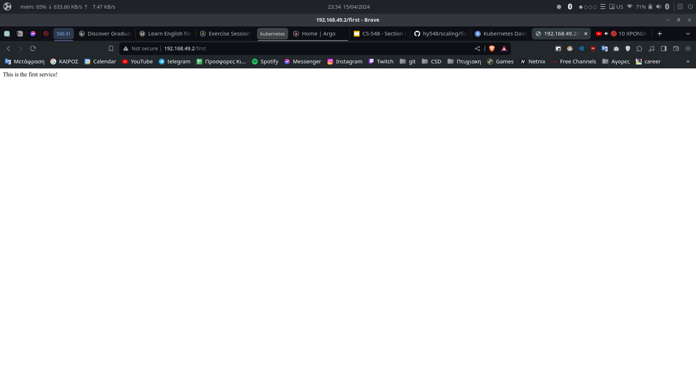

# Assignment 3
# Name: Konstantinos Loukas
# AM: csdp1375

<details>
<summary>Exercise 1</summary>


1. Instead of "Hello from Python Flask!", the flask-hello container will return the value of the MESSAGE environment variable when someone uses the service (use Python's os.getenv). Provide the new Dockerfile and hello.py. Build and upload the new container to Docker Hub.

    Dockerfile:
    ```
    FROM python:3.10.3-slim

    RUN pip install Flask

    COPY . /app
    WORKDIR /app
    ENV MESSAGE="Hello from csdp1375"

    CMD python hello.py
    ```

    Hello.py:
    ```
    import os
    from flask import Flask

    app = Flask(__name__)

    @app.route('/')
    def index():
        return os.getenv("MESSAGE")

    app.run(host='0.0.0.0', port=8080)
    ```

    Upload the image to Docker Hub.
    ```
    >docker tag flask:latest kostasloykas/assingment2:latest
    >docker push kostasloykas/assignment2
    ```

2. Provide two YAMLs to deploy the above container with all necessary resources (Deployment, Service, Ingress), so that "This is the first service!" is returned when someone visits the /first endpoint, and "This is the second service!" when someone visits the /second.

    first.yaml:
    ```
    apiVersion: networking.k8s.io/v1
    kind: Ingress
    metadata:
    name: flask-one-ingress
    annotations:
        nginx.ingress.kubernetes.io/rewrite-target: /
    spec:
    rules:
    - http:
        paths:
        - path: /first
            pathType: Prefix
            backend:
            service:
                name: flaskone
                port:
                number: 8080


    ---
    apiVersion: v1
    kind: Service
    metadata:
    name: flaskone
    spec:
    type: ClusterIP
    ports:
    - port: 8080
    selector:
        app: flaskone


    ---
    apiVersion: apps/v1
    kind: Deployment
    metadata:
    name: flaskone
    spec:
    replicas: 1
    selector:
        matchLabels:
        app: flaskone
    template:
        metadata:
        labels:
            app: flaskone
        spec:
        containers:
            - name: flaskone
            image: kostasloykas/assignment2:latest
            resources:
                limits:
                cpu: "200m"
                memory: "128Mi"
            env:
                - name: MESSAGE
                value: "This is the first service!"

    ```

    second.yaml:
    ```
    apiVersion: networking.k8s.io/v1
    kind: Ingress
    metadata:
    name: flask-two-ingress
    annotations:
        nginx.ingress.kubernetes.io/rewrite-target: /
    spec:
    rules:
    - http:
        paths:
        - path: /second
            pathType: Prefix
            backend:
            service:
                name: flasktwo
                port:
                number: 8080


    ---
    apiVersion: v1
    kind: Service
    metadata:
    name: flasktwo
    spec:
    type: ClusterIP
    ports:
    - port: 8080
    selector:
        app: flasktwo


    ---
    apiVersion: apps/v1
    kind: Deployment
    metadata:
    name: flasktwo
    spec:
    replicas: 1
    selector:
        matchLabels:
        app: flasktwo
    template:
        metadata:
        labels:
            app: flasktwo
        spec:
        containers:
            - name: flasktwo
            image: kostasloykas/assignment2:latest
            resources:
                limits:
                cpu: "200m"
                memory: "128Mi"
            env:
                - name: MESSAGE
                value: "This is the second service!"

    ```

3. Provide the commands needed to test the above two services with minikube (from running minikube, to curl or wget commands to use the services). Assume that the first deployment is in first.yaml and the second in second.yaml.

    The commands for testing the above two services are:
    ```
    minikube start
    minikube addons enable ingress
    minikube addons enable metrics-server
    kubectl apply -f locust.yaml
    kubectl apply -f first.yaml
    kubectl apply -f second.yaml
    minikube tunnel
    ```
    Afterward, when I requested the URL 192.168.49.2/first, it displayed the appropriate message. Similarly, when I accessed the URL 192.168.49.2/second, it also showed the corresponding message, as depicted in the pictures below.

    First service:
    

    Second service:
    


</details>

<details>
<summary>Exercise 2</summary>
</details>

